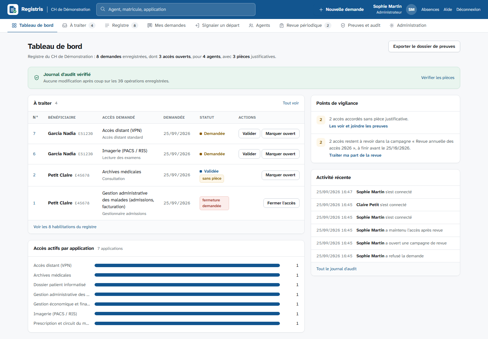
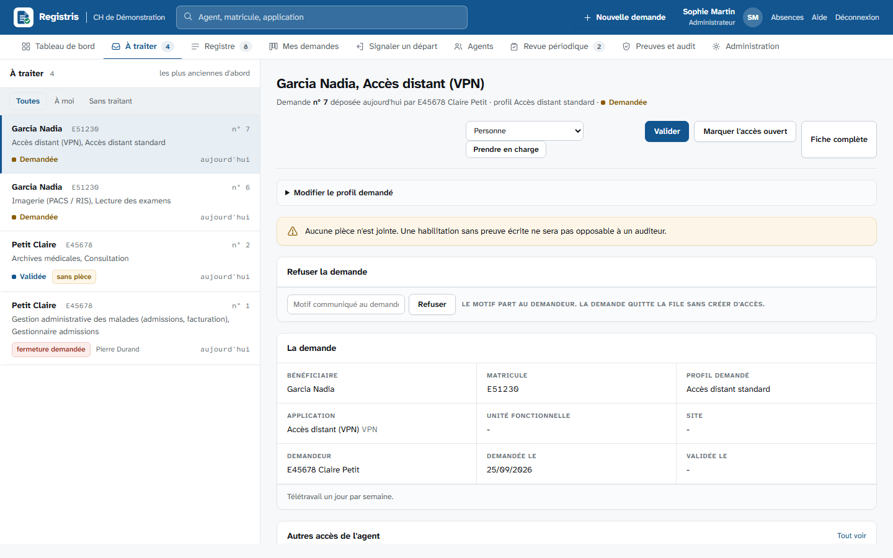
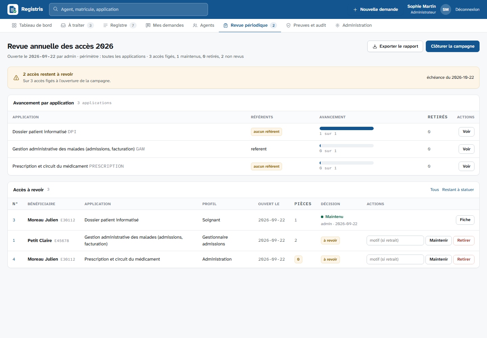

# Registris


**Registre des habilitations et coffre à preuves d'audit pour les établissements
publics de santé.**

Lors d'un contrôle (commissaires aux comptes, contrôle interne, PGSSI-S,
certification), on vous demande de prouver, matricule par matricule, **qui a
obtenu quel accès, sur quel logiciel, sur quelles unités fonctionnelles, quand,
à la demande de qui, et sur la base de quelle pièce**. Aujourd'hui la réponse est
dispersée dans des mois de courriels et de tableurs.

Registris en fait un registre unique, recherchable, avec les pièces
justificatives attachées et un journal infalsifiable. Quand l'auditeur transmet
sa liste de matricules échantillonnés, le dossier de preuves complet sort en un
clic.

> Logiciel libre (licence EUPL-1.2). Fonctionne entièrement sur votre réseau,
> sans aucun service externe. Présentation en ligne :
> <https://quentincazier.github.io/Registris/>.



La boîte de traitement : la file des demandes à gauche, le dossier complet et les actions à droite.



La revue périodique : chaque référent statue sur ses applications, et le rapport final dit aussi ce qui n'a pas été revu.



## Ce que fait l'outil

- **Bibliothèque de logiciels** : plutôt qu'une page blanche, une liste des
  logiciels couramment rencontrés en établissement de santé, rangés par fonction
  (identité et mouvements, dossier patient, laboratoire, imagerie, pharmacie,
  gestion financière, ressources humaines, socle technique). La DSI coche ceux
  qu'elle a, les catégories se créent avec les applications, et le reste s'ajoute
  à la main. La liste est indicative et se corrige par une contribution au dépôt.
  Les logos n'y sont pas : ce sont des marques, que ce dépôt ne peut pas
  rediffuser. Chaque établissement dépose le sien s'il l'a, sinon l'outil affiche
  un monogramme dont la teinte est dérivée du code de l'application.
- **Demande multiple** : on coche plusieurs applications au catalogue et on
  dépose une seule demande, avec un profil par application. Ce qui est groupé,
  c'est le geste : chaque accès garde ensuite son référent et son cycle de vie.
- **Départ d'un agent** : le cadre qui constate un départ saisit un matricule,
  et l'outil ouvre une demande de fermeture sur chacun des accès encore ouverts.
  Il n'a pas besoin de lire le registre, et n'apprend rien de ce qu'il ignorait :
  il reçoit un décompte, jamais la liste des accès.
- **Demandes d'habilitation** : un agent choisit l'application au catalogue,
  précise le profil demandé, les UF concernées, pour lui-même ou pour un
  collègue, et joint dans le même geste le courriel reçu ou une capture d'écran.
  Un pack « nouvel arrivant » dépose d'un coup tous les accès d'un poste.
- **Cycle de vie tracé** : demandée, validée, exécutée, révoquée, refusée. Chaque
  transition porte une date et un acteur ; les référents n'agissent que sur
  leurs applications. Un refus est motivé, le motif part au demandeur, et la
  demande quitte la file sans jamais devenir un accès : refusée n'est pas révoquée.
- **Demande de fermeture** : un cadre qui constate un départ, une mutation ou une
  fin de mission demande la fermeture d'un accès depuis sa fiche. La demande
  entre dans la file de traitement, mais **l'accès reste ouvert** tant qu'un
  référent de l'application ne l'a pas fermé, car c'est la vérité que doit dire
  le registre. Le référent ferme, ou refuse en motivant.
- **Prise en charge** : chaque demande de la file porte le nom de qui la traite.
  Un référent se l'attribue ou la confie à un pair de la même application, et
  filtre sa file sur « à moi » ou « sans traitant ».
- **Coffre à preuves** : on joint le courriel de la demande (.msg, .eml), la
  capture de la validation, le PDF signé. Chaque pièce est empreintée (SHA-256)
  au dépôt ; l'outil peut prouver à tout moment qu'elle n'a pas bougé.
- **Boîte de traitement** : la file à gauche, le dossier complet à droite. On
  valide, on exécute, on refuse, on ferme et on joint les pièces sans changer de
  page, et le manque de preuve est signalé **avant** le bouton de validation.
  Ouvertures et fermetures demandées attendent dans la même file.
- **Registre trié, filtré, paginé** : une ligne par habilitation, un clic sur
  une colonne pour trier, des onglets pour isoler ce qui attend ou ce qui n'a
  aucune pièce. Le même filtrage s'exporte en CSV (point-virgule et UTF-8 avec
  BOM : le fichier s'ouvre directement dans Excel), et l'export est tracé au
  journal.
- **Recherche par agent** : matricule ou nom, et l'on voit tous ses accès, leur
  statut, leurs dates et leurs preuves.
- **Fiche imprimable** : la fiche d'une habilitation s'imprime en dossier de
  preuve, avec l'empreinte SHA-256 complète de chaque pièce et la chaîne des
  écritures, sans les boutons ni la navigation.
- **Revue périodique** : une campagne fige les accès actifs, chaque référent
  statue sur ses applications (maintenir ou retirer, avec motif), et le rapport
  final dit aussi ce qui n'a jamais été revu. Un retrait révoque réellement
  l'habilitation. C'est ce qu'un auditeur demande juste après le registre.
- **Relances** : ce qui attend depuis plus d'une semaine est marqué « en retard »
  dans la file, compté au tableau de bord, et relancé par courriel auprès de qui
  tient la demande, ou de l'adresse de routage si personne ne l'a prise
  (`registris relancer`, à planifier). Une demande oubliée dans l'outil ne vaut
  pas mieux qu'un mail oublié dans une boîte.
- **Rapprochement avec les applications** : on dépose l'extraction des comptes
  d'un logiciel, quel qu'il soit, on indique quelle colonne contient le
  matricule, et l'outil confronte l'extraction au registre. Cinq constats, du
  plus grave au plus anodin : révoqué au registre mais toujours présent dans
  l'application, compte non déclaré, accès déclaré mais introuvable, ouverture
  non enregistrée, concordant. Chaque écart se solde en un clic par le référent
  (régulariser, révoquer, marquer exécutée, noter la fermeture), et tout renvoie
  à l'extraction d'origine, conservée avec son empreinte. C'est la seule réponse
  à la question « et les accès que personne n'a déclarés ? ».
- **Indicateurs de délai** : du dépôt à l'ouverture, et surtout du signalement
  d'un départ à la fermeture réelle, par application, sur trois, six ou douze
  mois, avec les volumes mensuels. Médiane et « 9 sur 10 en moins de » plutôt
  que moyenne, qu'une seule demande oubliée suffit à fausser. Le délai de
  fermeture est lu dans le journal scellé, pas dans une colonne modifiable.
  Exportable en CSV.
- **Dossier de preuves pour l'auditeur** : on colle les matricules échantillonnés,
  on obtient un ZIP horodaté : synthèse imprimable, tableau CSV, manifeste des
  empreintes et toutes les pièces classées par matricule.
- **Journal d'audit chaîné et ancré** : chaque action (connexion, création,
  validation, dépôt ou consultation d'une preuve, export) est scellée par
  l'empreinte de l'entrée précédente. Toute modification a posteriori est
  détectée, et l'ancrage quotidien de la tête de chaîne hors de la base
  (fichier, courriel) rend détectable un remplacement de la base entière.
- **Sauvegarde et restauration** en une commande, avec manifeste d'empreintes
  et contrôle d'une archive sans rien écrire.
- **Authentification Active Directory** (bind LDAPS, rôles par groupes AD,
  groupes imbriqués en option, compte local de secours quand l'annuaire est
  injoignable) ou comptes locaux ; notifications par le relais SMTP interne.

## Ce que l'outil ne fait pas

- Il ne crée pas les comptes dans vos logiciels métier : il **trace** les
  décisions et **conserve** les preuves. L'exécution technique reste dans les
  mains de la DSI.
- Il ne remplace pas un outil ITSM (incidents, parc, SLA). Il se concentre sur
  la gouvernance des accès et la preuve.
- Il ne contient aucune donnée patient. Il traite des données RH internes
  (matricule, nom, courriel professionnel), à inscrire au registre des
  traitements de l'établissement.

## Installer

Chaque [release](https://github.com/QuentinCazier/Registris/releases) fournit
une archive avec les dépendances incluses, un installateur Windows (service,
HTTPS, compte administrateur, pare-feu), un script Linux (systemd, entretien
quotidien) et une image Docker. Le serveur n'a besoin que de Node.js, sans
accès à internet. Tout est décrit dans [docs/INSTALLATION.md](docs/INSTALLATION.md).

## Essayer en cinq minutes

Prérequis : [Node.js](https://nodejs.org) 22 ou plus récent. Aucune base de
données à installer (SQLite intégré), aucun compilateur.

```bash
git clone https://github.com/QuentinCazier/Registris.git
cd registris
npm install
npm run demo      # base de démonstration (données fictives)
npm start         # http://127.0.0.1:3000
```

Comptes de démonstration (mot de passe commun `demo-registris`) :

| Identifiant | Rôle | Ce qu'il peut faire |
|---|---|---|
| `admin` | Administrateur | tout, y compris le catalogue et les comptes |
| `referent` | Référent applicatif | valider, refuser, exécuter, fermer et prendre en charge sur ses applications (GAM, Archives) |
| `controleur` | Contrôleur | lire le registre, le journal, produire le dossier de preuves |
| `agent` | Utilisateur | déposer des demandes, joindre des preuves, suivre les siennes |

Pour une vraie installation, voir [docs/INSTALLATION.md](docs/INSTALLATION.md)
(installateurs) et [docs/DEPLOIEMENT.md](docs/DEPLOIEMENT.md)
(reverse-proxy HTTPS, Active Directory, SMTP, sauvegardes),
[docs/AUDIT.md](docs/AUDIT.md) (comment s'en servir pendant un audit) et
[docs/ACCESSIBILITE.md](docs/ACCESSIBILITE.md) (ce qui est vérifié, ce qui ne
l'est pas, et le modèle de déclaration à compléter par l'établissement).

## Ligne de commande

```
registris init                     crée la base si besoin
registris servir                   démarre le serveur (défaut)
registris utilisateur <login> <rôle> <nom>
                                           crée un compte local (mot de passe demandé)
registris ufs <fichier.csv>        importe un référentiel d'UF (code;libelle)
registris verifier                 vérifie la chaîne d'audit, ses ancrages et l'intégrité du coffre
registris ancrer                   dépose l'empreinte de tête de la chaîne hors de la base (fichier, courriel)
registris sauvegarder [dossier]    archive ZIP autoportante : base, pièces, logos, ancrages, manifeste
registris restaurer <zip> [--verifier] [--forcer]
                                           contrôle une archive, ou la redéploie sur une installation arrêtée
registris tester-ldap <login>      diagnostic pas à pas de la connexion à l'annuaire
registris demo                     charge le jeu de démonstration
```

## Aux couleurs de l'établissement

Trois réglages, sans toucher au code :

| Réglage | Où | Effet |
|---|---|---|
| `NOM_ETABLISSEMENT` | `.env` | nom affiché dans la barre haute, sur la page de connexion et dans les exports |
| `COULEUR_ACCENT` | `.env` | couleur de la barre haute, des boutons, des liens et de l'onglet actif |
| `marque.svg`, `logo.png`, `favicon.ico` | dossier `public/` | la marque de l'établissement remplace celle de Registris |

La nuance de survol, le fond clair et la couleur du texte posé sur la barre sont
déduits de `COULEUR_ACCENT` : une teinte claire ne produira jamais du blanc
illisible sur fond jaune. Les couleurs de statut, elles, ne changent pas d'un
établissement à l'autre : attente, active, close, et le rouge réservé aux
anomalies (chaîne rompue, pièce altérée). Détails dans
[public/README.md](public/README.md).

## Architecture

- **Node.js + Express**, rendu HTML côté serveur, aucun framework front, aucun
  script tiers chargé depuis Internet. Les deux polices de l'interface
  (Atkinson Hyperlegible, licence SIL Open Font) sont servies depuis le dépôt :
  aucune requête sortante, et des caractères qui ne se confondent pas quand on
  lit des matricules et des empreintes.
- **SQLite** via le module natif `node:sqlite` : un seul fichier `data/*.db` à
  sauvegarder, sur un disque local (jamais sur un partage réseau).
- **Pièces de preuve** stockées sur disque sous un nom neutre, validées par
  extension et par signature binaire, empreintées SHA-256.
- **Journal chaîné** : table `journal_audit`, chaque ligne contient le hash de
  la précédente ; `registris verifier` recalcule toute la chaîne.
- Dépendances : `express`, `express-session`, `multer` (téléversement),
  `archiver` (ZIP), `ldap-authentication` (AD), `nodemailer` (SMTP). Aucune
  dépendance native.

```
src/
  config.js          configuration (.env), garde-fous de production
  db.js              SQLite, schéma, migrations, transactions
  auth.js            connexion locale (scrypt) ou LDAP
  annuaire.js        accès direct à l'annuaire : groupes imbriqués, recherche d'agents
  roles.js           rôles, permissions, périmètre des référents
  sessions.js        sessions web en base SQLite
  audit.js           journal chaîné, contrôle complet et point de reprise
  habilitations.js   cœur métier : agents, demandes, cycle de vie, départs
  revues.js          revue périodique des accès
  relances.js        relance des demandes en attente
  indicateurs.js     délais d'ouverture et de fermeture, volumes
  rapprochements.js  lecture des extractions, constats, suites données aux écarts
  preuves.js         coffre à preuves (validation, empreintes)
  export-audit.js    dossier de preuves ZIP
  administration.js  catalogue, bibliothèque, référentiels, comptes, packs
  logiciels.js       bibliothèque des logiciels, séparée du code pour se corriger seule
  serveur.js         socle web : en-têtes, session, jeton CSRF, montage des routes
  routes/            une page ou une famille d'actions par fichier
  ui.js              gabarit et composants HTML
  cli.js             ligne de commande
tests/               tests (node:test), dont des tests HTTP de bout en bout
installation/        installateur Windows, script Linux, exemple Docker Compose
site/                page de présentation publiée sur GitHub Pages
Dockerfile           image publiée sur ghcr.io à chaque release
```

`serveur.js` ne contient plus de route : il pose la sécurité commune puis monte
les modules de `routes/` dans un ordre qui compte. Express essaie les routes dans
l'ordre où elles sont déclarées : `/habilitations/nouvelle` doit donc passer avant
`/habilitations/:id`, et chaque action nommée avant l'action générique.

## Sécurité

En-têtes de sécurité (CSP, X-Frame-Options, nosniff), cookies de session
`httpOnly` et `sameSite`, sessions en base, jeton CSRF sur chaque formulaire,
blocage temporaire après cinq échecs de connexion, contrôle des droits sur
chaque route, validation des fichiers téléversés, refus de démarrer en
production sans secret de session.
Le chiffrement TLS est confié à un reverse-proxy (voir la documentation de
déploiement). Signalement d'une faille : voir [SECURITY.md](SECURITY.md).

## Contribuer

Retours d'expérience d'établissements, corrections, traductions de la
documentation : voir [CONTRIBUTING.md](CONTRIBUTING.md). Ne joignez jamais de
données réelles (export, base, pièces) à un ticket.

## Versions

L'historique des versions est tenu dans [CHANGELOG.md](CHANGELOG.md).

## Licence

Code publié sous [licence publique de l'Union européenne EUPL-1.2](LICENSE),
compatible avec la politique logiciels libres de l'État. Version française du
texte : <https://eupl.eu/1.2/fr/>.
