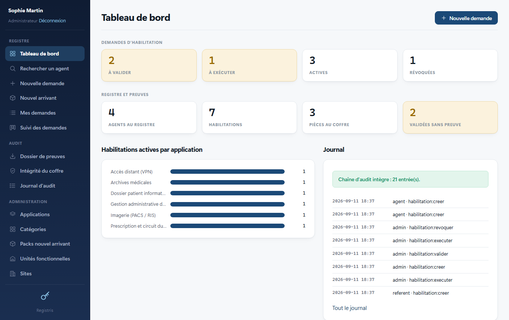

# Registris

**Registre des habilitations et coffre à preuves d'audit pour les établissements
publics de santé.**

Lors d'un contrôle (commissaires aux comptes, contrôle interne, PGSSI-S,
certification), on vous demande de prouver, matricule par matricule, **qui a
obtenu quel accès, sur quel logiciel, sur quelles unités fonctionnelles, quand,
à la demande de qui, et sur la base de quelle pièce**. Aujourd'hui la réponse est
dispersée dans des mois de courriels et de tableurs.

Registris en fait un registre unique, recherchable, avec les pièces
justificatives attachées et un journal infalsifiable. Quand l'auditeur transmet
sa liste de matricules échantillonnés, le dossier de preuves complet sort en un
clic.

> Logiciel libre (licence EUPL-1.2). Fonctionne entièrement sur votre réseau,
> sans aucun service externe.



## Ce que fait l'outil

- **Demandes d'habilitation** : un agent choisit l'application au catalogue,
  précise le profil demandé, les UF concernées, pour lui-même ou pour un
  collègue. Un pack « nouvel arrivant » dépose d'un coup tous les accès d'un poste.
- **Cycle de vie tracé** : demandée, validée, exécutée, révoquée. Chaque
  transition porte une date et un acteur ; les référents n'agissent que sur
  leurs applications.
- **Coffre à preuves** : on joint le courriel de la demande (.msg, .eml), la
  capture de la validation, le PDF signé. Chaque pièce est empreintée (SHA-256)
  au dépôt ; l'outil peut prouver à tout moment qu'elle n'a pas bougé.
- **Recherche par agent** : matricule ou nom, et l'on voit tous ses accès, leur
  statut, leurs dates et leurs preuves.
- **Dossier de preuves pour l'auditeur** : on colle les matricules échantillonnés,
  on obtient un ZIP horodaté : synthèse imprimable, tableau CSV, manifeste des
  empreintes et toutes les pièces classées par matricule.
- **Journal d'audit chaîné et ancré** : chaque action (connexion, création,
  validation, dépôt ou consultation d'une preuve, export) est scellée par
  l'empreinte de l'entrée précédente. Toute modification a posteriori est
  détectée, et l'ancrage quotidien de la tête de chaîne hors de la base
  (fichier, courriel) rend détectable un remplacement de la base entière.
- **Sauvegarde et restauration** en une commande, avec manifeste d'empreintes
  et contrôle d'une archive sans rien écrire.
- **Authentification Active Directory** (bind LDAPS, rôles par groupes AD) ou
  comptes locaux ; notifications par le relais SMTP interne.

## Ce que l'outil ne fait pas

- Il ne crée pas les comptes dans vos logiciels métier : il **trace** les
  décisions et **conserve** les preuves. L'exécution technique reste dans les
  mains de la DSI.
- Il ne remplace pas un outil ITSM (incidents, parc, SLA). Il se concentre sur
  la gouvernance des accès et la preuve.
- Il ne contient aucune donnée patient. Il traite des données RH internes
  (matricule, nom, courriel professionnel), à inscrire au registre des
  traitements de l'établissement.

## Démarrage en cinq minutes

Prérequis : [Node.js](https://nodejs.org) 22 ou plus récent. Aucune base de
données à installer (SQLite intégré), aucun compilateur.

```bash
git clone https://github.com/QuentinCazier/registris.git
cd registris
npm install
npm run demo      # base de démonstration (données fictives)
npm start         # http://127.0.0.1:3000
```

Comptes de démonstration (mot de passe commun `demo-registris`) :

| Identifiant | Rôle | Ce qu'il peut faire |
|---|---|---|
| `admin` | Administrateur | tout, y compris le catalogue et les comptes |
| `referent` | Référent applicatif | valider, exécuter, révoquer sur ses applications (GAM, Archives) |
| `controleur` | Contrôleur | lire le registre, le journal, produire le dossier de preuves |
| `agent` | Utilisateur | déposer des demandes, joindre des preuves, suivre les siennes |

Pour une vraie installation, voir [docs/DEPLOIEMENT.md](docs/DEPLOIEMENT.md)
(reverse-proxy HTTPS, Active Directory, SMTP, sauvegardes) et
[docs/AUDIT.md](docs/AUDIT.md) (comment s'en servir pendant un audit).

## Ligne de commande

```
registris init                     crée la base si besoin
registris servir                   démarre le serveur (défaut)
registris utilisateur <login> <rôle> <nom>
                                           crée un compte local (mot de passe demandé)
registris ufs <fichier.csv>        importe un référentiel d'UF (code;libelle)
registris verifier                 vérifie la chaîne d'audit, ses ancrages et l'intégrité du coffre
registris ancrer                   dépose l'empreinte de tête de la chaîne hors de la base (fichier, courriel)
registris sauvegarder [dossier]    archive ZIP autoportante : base, pièces, logos, ancrages, manifeste
registris restaurer <zip> [--verifier] [--forcer]
                                           contrôle une archive, ou la redéploie sur une installation arrêtée
registris tester-ldap <login>      diagnostic pas à pas de la connexion à l'annuaire
registris demo                     charge le jeu de démonstration
```

## Architecture

- **Node.js + Express**, rendu HTML côté serveur, aucun framework front, aucun
  script tiers chargé depuis Internet.
- **SQLite** via le module natif `node:sqlite` : un seul fichier `data/*.db` à
  sauvegarder, sur un disque local (jamais sur un partage réseau).
- **Pièces de preuve** stockées sur disque sous un nom neutre, validées par
  extension et par signature binaire, empreintées SHA-256.
- **Journal chaîné** : table `journal_audit`, chaque ligne contient le hash de
  la précédente ; `registris verifier` recalcule toute la chaîne.
- Dépendances : `express`, `express-session`, `multer` (téléversement),
  `archiver` (ZIP), `ldap-authentication` (AD), `nodemailer` (SMTP). Aucune
  dépendance native.

```
src/
  config.js          configuration (.env), garde-fous de production
  db.js              SQLite, schéma, transactions
  auth.js            connexion locale (scrypt) ou LDAP
  roles.js           rôles, permissions, périmètre des référents
  audit.js           journal chaîné
  habilitations.js   cœur métier : agents, demandes, cycle de vie
  preuves.js         coffre à preuves (validation, empreintes)
  export-audit.js    dossier de preuves ZIP
  administration.js  catalogue, référentiels, comptes, packs
  serveur.js         routes HTTP, sécurité web
  ui.js              gabarit et composants HTML
  cli.js             ligne de commande
tests/               tests (node:test), dont un test HTTP de bout en bout
```

## Sécurité

En-têtes de sécurité (CSP, X-Frame-Options, nosniff), cookies de session
`httpOnly` et `sameSite`, jeton CSRF sur chaque formulaire, blocage temporaire
après cinq échecs de connexion, contrôle des droits sur chaque route, validation
des fichiers téléversés, refus de démarrer en production sans secret de session.
Le chiffrement TLS est confié à un reverse-proxy (voir la documentation de
déploiement). Signalement d'une faille : voir [SECURITY.md](SECURITY.md).

## Contribuer

Retours d'expérience d'établissements, corrections, traductions de la
documentation : voir [CONTRIBUTING.md](CONTRIBUTING.md). Ne joignez jamais de
données réelles (export, base, pièces) à un ticket.

## Licence

Code publié sous [licence publique de l'Union européenne EUPL-1.2](LICENSE),
compatible avec la politique logiciels libres de l'État. Version française du
texte : <https://eupl.eu/1.2/fr/>.
